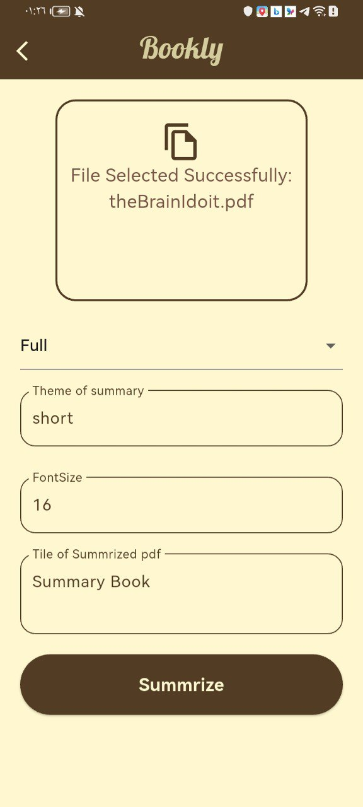

# Bookly 📚💡

## Description  
Bookly is a Flutter-based mobile application designed to summarize files and PDFs, providing users with the ability to quickly get insights from documents. The app uses **Clean Architecture** to ensure scalability and maintainability while offering key features like document summarization and book recommendations.

Key highlights include:
- **Real-time Summarization** via APIs  
- **AI-driven PDF/Text Summarization** for quick insights  
- **Secure Authentication** using Flask for user privacy  
- **Cubit State Management** for efficiency  
- **Layered Architecture** for better testability and scalability  
- **User-Friendly UI** for an optimal experience  

## Features  
✅ **Authentication** – Secure login and registration using Flask  
✅ **Summarization** – Upload and summarize files or PDFs  
✅ **Book Recommendations** – Get book suggestions based on NY Times API  
✅ **Saved Summaries** – Save and view past document summaries

## Technologies Used  
- **Flutter** (Dart)  
- **Cubit** for state management  
- **Flask** for backend authentication and summarization  
- **REST APIs** for NY Times Book recommendations and local summarization API  
- **AI/ML Models** for summarizing documents (if applicable)

  
### Screen Shots

## Splach Screen

## Auth Screen

## Home Screen

## Summarize Screen

## Library Screen

## Book Screen

